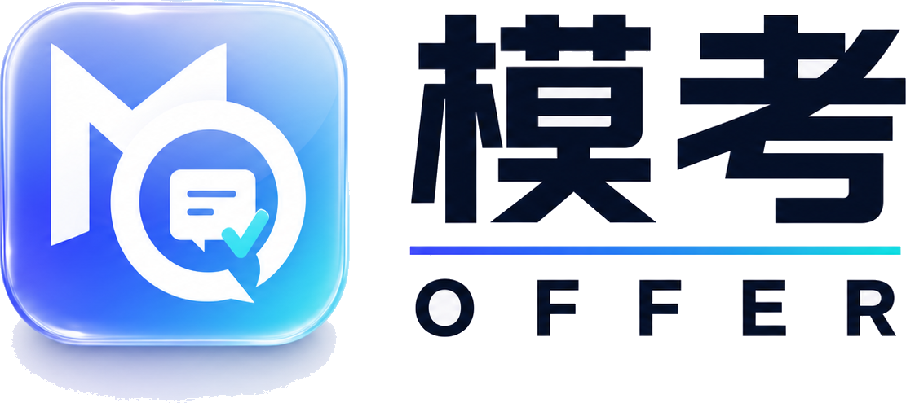

<div align="center">



# 模考Offer · MockOffer

**The all-in-one AI job-hunting platform**

[](https://github.com/keaipiao/MockOffer/actions/workflows/ci.yml)
[](LICENSE)
[](https://nextjs.org)
[](https://spring.io)
[](https://lingji1dong.com)

[Website mockoffer.com](https://mockoffer.com) · [中文](README.md) | **English**

</div>

---

**MockOffer** is an open-source, end-to-end AI platform for job seekers: from résumé to interview, all the way to your offer.

The official hosted site [mockoffer.com](https://mockoffer.com) is free for core features, with paid advanced AI features to sustain the project. Fully open-source and self-hostable.

## ✨ Features

- Passwordless email-code login + GitHub OAuth
- Template-based résumé builder: templates, forms, toggle/custom modules, AI polish, live preview, export
- Job input & résumé–job matching: AI scores "résumé × job", flags gaps, one-click fixes
- AI mock interview: multi-turn, dynamically generated questions, per-round scoring
- AI interview report: overall + per-dimension scores, strengths, improvements, transcript review

## 🧱 Tech stack

Next.js 16 · Spring Boot 4.1 / Java 21 · PostgreSQL 18 · Redis · MinIO · DeepSeek (via Spring AI) · Docker Compose

## 🚀 Quick start

Prerequisite: [Docker](https://www.docker.com/) & Docker Compose.

```bash
git clone https://github.com/keaipiao/MockOffer.git
cd MockOffer
make up                 # macOS / Linux
./scripts/dev.ps1 up    # Windows
```

Service URLs are printed on startup (frontend http://localhost:3000, backend http://localhost:8080, MinIO console http://localhost:9001).
Stop with `make down` or `./scripts/dev.ps1 down`.

## 🗺 Roadmap

M0 Foundation (architecture / design system / scaffold) ✅ → M1 Auth → M2 Résumé builder → M3 Job input → M4 Résumé–job matching → M5 AI mock interview → M6 Interview report → M7 Monetization

## 🤝 Contributing

See [CONTRIBUTING.md](CONTRIBUTING.md). Issues and PRs welcome.

## 💡 About LingJi (灵计一动)

Built and tracked with [LingJi](https://lingji1dong.com), an inspiration-driven project board for AI developers that syncs plans in real time between the web and your AI coding tools.

## 📄 License

[MIT](LICENSE)
