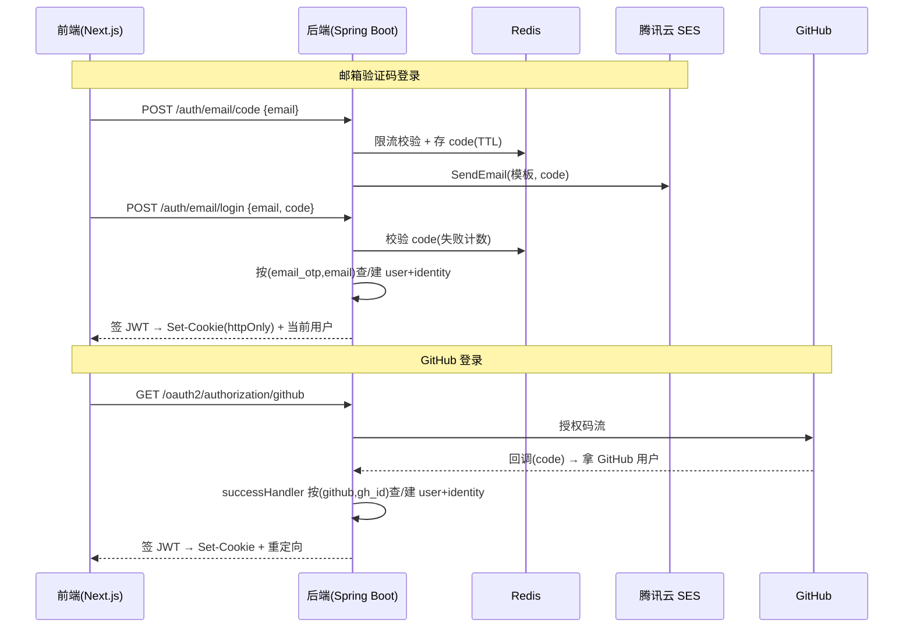

# 01-账号体系 · 设计

> 功能级设计文档，对应 `开发流程SOP.md` §四 阶段 1~3：**立项需求 → UI 设计 → 技术方案**。
> 各阶段产出后按闸门停下请用户评审（标 ✅ 的阶段）再进下一节。
> 计划、进度、过程笔记**不写这里** —— 去灵计一动看板。
> 对应里程碑灵感：M1 账号体系（id=141）。

---

## 1. 需求（SOP 阶段 1 立项）

### 1.1 做什么
为平台提供**认证与会话**：用户用「邮箱验证码（无密码）」或「GitHub 快捷登录」进入产品，并在登录后可管理自己绑定的登录方式。

### 1.2 意图 / 想达成的效果
让国内求职者用最低门槛进站（无需记密码、可一键 GitHub 登录），同时把身份模型一次性设计干净，后续接入手机号 / 微信等方式时不返工。

### 1.3 不做什么（scope 边界）
- **不做用户名（username）、不做密码登录**：登录凭证只用「邮箱验证码 / 第三方 OAuth」；公开展示标识（如简历分享 handle）与登录解耦，归后续里程碑按需再加。
- **不做个人信息录入**：姓名、简历等资料归 M2 简历制作里程碑，本里程碑只管「是谁能登进来」，不碰业务资料。
- **本期只实现「邮箱验证码 + GitHub」两种方式**：手机号、微信等仅在数据模型上预留扩展位，不在本里程碑实现。
- **不做跨登录方式的账号自动合并 / 账号 merge**：见 1.5 身份模型，合并只走「登录后在设置页主动绑定」。

### 1.4 怎么算做好了
- 新用户能用邮箱验证码完成首次注册并登录、拿到会话；老用户再次用同一邮箱验证码回到同一账号。
- 用户能用 GitHub 一键登录；首次 GitHub 登录即自建账号。
- 登录后能在设置页查看 / 新增绑定 / 解绑第三方登录方式，且绑定已被占用的身份时被正确拒绝。
- 会话可正常保持与登出。

### 1.5 身份模型方向（立项已拍板，细节留 §3）
- **canonical 身份 = 系统内部自生成的 user_id**（代理主键），与任何登录方式、与邮箱解耦。
- 每种登录方式 = 一条 identity，挂到同一 user_id 下；identity 的标识 = 「(登录方式, 该方式的稳定标识)」：邮箱验证码用邮箱本身、GitHub 用 GitHub 用户 id、（预留）手机号用手机号、微信用 unionid。
- **登录规则**：按「(登录方式, 标识)」查 identity，命中进对应账号，不命中则**新建账号**——任意方式都能独立首次注册。
- **永不跨方式自动归并**（含不拿 GitHub 回传邮箱去自动匹配邮箱账号——那是 GitHub 侧验证、非本平台验证，自动归并有账号接管风险）。多方式 = 登录后在设置页**主动绑定**；绑定时目标身份若已被其它账号占用则拒绝，不做账号 merge。
- 已知可接受代价：同一人用不同方式可能产生多个独立账号，靠设置页「绑定更多登录方式」引导收拢，系统不猜测合并。

---

## 2. UI 设计（SOP 阶段 2）

> 无前端则本章填「本功能无前端，不适用」—— **保留章节**、不删（SOP 与跨文档引用都靠章节号定位）。

### 2.1 设计依据
- 沿用 `docs/设计规范.md`：§1 基调（玻璃质感 + 灵动岛悬浮导航，浅色为主、深色为辅）、§2 配色、§3 字体、§4 间距/圆角/阴影、§5 组件。
- 视觉语言对齐现有样板 `docs/资源/样板/登录-浅.png`、`登录-深.png`（玻璃登录卡 + 品牌渐变 CTA）；样板为单屏式，本里程碑改两步式，玻璃卡视觉沿用、布局重画。
- 本功能新增的 token / 组件回填 §2.5 后补进 `设计规范.md`。

### 2.2 设计稿（线框图 / 视觉稿）
- **路线 C（AI 生图作参考）**：按 `设计规范.md` §9，用 codex 生成高保真参考图，再转可开发高保真静态稿（真实 HTML/CSS、像素可对齐）。
- 逐屏铁律：一画面一稿、真实视口、可开发；AI 参考图仅定方向、不直接当开发稿。
- 屏清单（GitHub 回调并入第一步加载态，不单独出稿）：
  1. 登录·第一步：邮箱输入 + GitHub 登录入口
  2. 登录·第二步：返回置左上、6 位验证码、重发为文字链接（登录按钮上方）、主按钮「登录 / 注册」
  3. 全局顶部导航 + 头像下拉：灵动岛胶囊导航 `Logo｜首页｜工作台｜岗位｜右侧头像`（宽度自适应、固定高度、大圆角、竖线分割、当前项白底蓝字胶囊）；头像下拉「账号设置 / 退出登录」
  4. 账号设置页：全局导航 +「左侧分类侧栏 + 右侧登录方式内容」合并为一张玻璃卡、中间竖线分隔；仅「登录方式」为「账号与安全」子项（缩进），消息通知/隐私/偏好为顶级灰显占位「即将支持」；无独立页面大标题
- 信息架构（评审定）：账号设置从头像下拉进入；设置页左栏分类 + 右侧内容**合并单卡、竖线分隔**；M1 只做登录方式一项，其余分类占位、归后续里程碑。
- 参考图（codex 生成，定方向）：`资源/参考图/ref-login-step1.png`、`ref-login-step2.png`、`ref-account-methods.png`（账号设置图含导航 + 头像下拉）
- 可开发高保真稿（HTML/CSS，浏览器可直接打开，含浅色 + 移动端媒体查询）：`资源/login-step1.html`、`资源/login-step2.html`、`资源/account-settings.html`
- 深色版未单独出稿：色值已在 `设计规范.md` §2 给出浅/深两套，实现阶段按 token 切换即可。

### 2.3 状态规划
- **响应式**：桌面居中玻璃卡（约 400–440px 宽）；移动端卡片近满宽、留 16–24px 边距，CTA 通栏。
- **暗色模式**：浅/暗两套，对齐 `设计规范.md` §2 浅/深色值；深色卡用 `rgba(255,255,255,0.06)` + 高光描边。
- **加载中**：发送验证码 / 校验 / GitHub 跳转时，按钮转 loading（禁用 + spinner）；GitHub 回调为整页轻量加载态。
- **出错**：邮箱格式错误、验证码错误/过期、第三方绑定已被占用 → 输入框下方红色错误文案（`设计规范.md` 错误色），不弹窗打断。
- **空数据**：账号设置页「登录方式」最少保留一种已绑方式（不可解绑到 0）；已绑方式直接显示账号、未绑方式左侧不写状态、右侧给「绑定」按钮（不再写「已绑定/未绑定」状态词）。
- **倒计时**：第二步重发为文字链接，倒计时中灰色禁用「重新发送验证码 (60s)」，结束后变品牌色可点。
- **返回**：第二步返回箭头 +「返回」置卡片左上单独一行（不与 Logo 同行，第二步不放居中大 Logo）。

### 2.4 文案规范
- 第二人称、简洁专业；登录与注册合一，文案统一用「登录 / 注册」不区分新老用户。
- 关键文案：首次登录将自动为你注册 / 发送验证码 / 重新发送验证码 (NNs) / 验证码已发送至 邮箱 / 没收到?请检查垃圾邮件文件夹 / 更多登录方式即将支持 / 使用 GitHub 登录 / 登录 / 注册 / 绑定 / 解绑 / 至少保留一种登录方式 / 扫码绑定,快捷登录 / 账号设置 / 退出登录 / 即将支持 / 返回修改邮箱。
- 进入 URL / 接口标识的字段用英文（如 `email`、`code`、`github`），避免编码问题。

### 2.5 新增 token / 组件
本次未引入超出 `设计规范.md` §2–4 的新色值/字号/圆角（全部复用既有 token）。沉淀的通用组件（玻璃卡、胶囊导航 + 头像下拉、按钮各态、输入框、6 位验证码、设置页骨架、列表行、徽章）与响应式断点，已于 UI 评审通过后**回填 `设计规范.md` §5 / §6**。

### 2.6 实现阶段注意（UI 已规划、留待编码落实）
- **交互行为**：输入框 focus、按钮 hover/active 已用纯 CSS 体现；验证码当前激活格高亮、倒计时结束「重新发送」转可点需脚本驱动。
- **验证码移动端**：支持整段粘贴 / 短信自动填充（`autocomplete="one-time-code"`）。
- **错误态**：邮箱格式错、验证码错/过期、第三方绑定已被占用 → 输入框下方红字（见 §2.3）。
- **安全**：解绑前二次确认；仅剩一种登录方式时禁止解绑（呼应「至少保留一种」）。
- **资源**：头像现用在线占位（`pravatar`），实现接用户上传头像；若后续做深色主题，补横版 logo 深色变体。

---

## 3. 技术方案（SOP 阶段 3）

> 含调研：动手定方案前先查清官方文档 / 竞品做法 / 项目内可复用代码，再据此设计。

### 3.1 调研

**关键技术 / API 用法**（联网核实，对应 M0 已定栈：Spring Boot 4.1 / Spring Security 7 / PostgreSQL 18 / Redis 7 / 腾讯云 SES）：
- **GitHub 登录（Spring Security 7 OAuth2）**：用 `spring-boot-starter-oauth2-client` 的 `oauth2Login()` 走授权码流；**不直接用它建会话**，而是配 `.successHandler(自定义)`——回调拿到 `OAuth2User`（GitHub `id`/`login`/`email`）后由我方逻辑查/建 identity、**签发自有 JWT 写入 httpOnly cookie**、再重定向回前端。
- **JWT 无状态鉴权**：`oauth2ResourceServer().jwt()` + `JwtDecoder`（Nimbus）；默认从 `Authorization` 头取 token，我们 token 在 cookie，需自定义 `BearerTokenResolver` 从 httpOnly cookie 读 JWT；`SessionCreationPolicy.STATELESS`。签发用 `JwtEncoder`（Nimbus，HS256 对称密钥）。
- **验证码（Redis）**：码存 Redis 带 TTL；发码间隔、每日上限、校验失败次数均用 Redis 计数实现限流。
- **发码（腾讯云 SES）**：`SesClient.SendEmail` + **预先审核的模板**（`TemplateData` 传 JSON 填入验证码）；发件域名与模板需提前在控制台审核（实现/部署前置）。

**行业做法**：无密码（邮箱 OTP + 第三方 OAuth）+ 账号绑定，是 2025 主流；归一键用内部 user_id、第三方不自动 merge，避免账号接管（见 §1.5 已定方向）。

**项目内可复用**：后端脚手架仅 `actuator + webmvc`、无鉴权基础，账号体系从零建。**需新增依赖**：`spring-boot-starter-security`、`spring-boot-starter-oauth2-client`、`spring-boot-starter-data-jpa`、`org.postgresql:postgresql`、`spring-boot-starter-data-redis`、`com.tencentcloudapi:tencentcloud-sdk-java-ses`、Flyway（`flyway-core` + `flyway-database-postgresql`）。

### 3.2 总览

后续每个请求：浏览器自动带 httpOnly cookie → 后端 `BearerTokenResolver` 从 cookie 取 JWT → 无状态校验。

### 3.3 数据模型

> PostgreSQL；DDL 用 Flyway 迁移脚本 `V1__create_account.sql` 建下面两表。canonical 身份 = `users.id`，与登录方式解耦。所有表带 `deleted_at` 软删（全局约定，见 §3.5）；显示名 / 昵称归 M2 `user_profiles`，M1 登录态以邮箱或「用户#id」展示。

**`users`**（账号主体，无密码、无 username）
| 字段 | 类型 | 约束 | 说明 |
|---|---|---|---|
| id | BIGINT | PK，**自增** | canonical id、JWT sub；自增便于将来社区场景展示「用户编号」（1 号 / xx 号用户）。仅此表自增 |
| status | SMALLINT | NOT NULL，默认 1 | 1 正常 / 0 禁用 |
| created_at | TIMESTAMPTZ | NOT NULL | |
| updated_at | TIMESTAMPTZ | NOT NULL | |
| last_login_at | TIMESTAMPTZ | 可空 | |
| deleted_at | TIMESTAMPTZ | 可空 | 逻辑删除；非空=已删，查询默认过滤 |

**`user_identities`**（登录方式，一个 user 多条）
| 字段 | 类型 | 约束 | 说明 |
|---|---|---|---|
| id | BIGINT | PK，**雪花 ID** | 非 users 表统一用雪花 ID（BIGINT、分布式、不暴露业务量） |
| user_id | BIGINT | NOT NULL，FK→users.id | |
| provider | VARCHAR(20) | NOT NULL | `email_otp` / `github` /（预留）`phone` / `wechat` |
| provider_uid | VARCHAR(254) | NOT NULL | 稳定标识：邮箱（规范化小写）/ GitHub numeric id / 手机号 / unionid |
| meta | JSONB | 可空 | provider 附加信息（GitHub：login/avatar/email；微信：昵称/头像 等）；附带邮箱也存这里、**不参与唯一与归并**；每次该方式登录刷新 |
| last_used_at | TIMESTAMPTZ | 可空 | 该登录方式最近使用时间 |
| created_at | TIMESTAMPTZ | NOT NULL | |
| deleted_at | TIMESTAMPTZ | 可空 | 逻辑删除；解绑走软删 |

- **部分唯一索引** `uk_provider_uid (provider, provider_uid) WHERE deleted_at IS NULL`：仅对未删行唯一（= 登录归一键 + 绑定占用判断）；解绑软删后该标识可被重新绑定。
- **索引** `idx_user_id (user_id) WHERE deleted_at IS NULL`：按账号列其有效登录方式。

### 3.4 接口契约

> 业务接口前缀 `/api`；OAuth 端点 `/oauth2/authorization/github`、`/login/oauth2/code/github` 为 Spring 固定路径、不带 `/api`。登录态靠 httpOnly cookie 中的 JWT。出参统一包 `{code,msg,data}`，下表只列 data 要点。

| 方法 | 路径 | 入参 | 出参 | 说明 |
|---|---|---|---|---|
| POST | `/auth/email/code` | `{email}` | 空 | 发验证码；限流（间隔/日上限） |
| POST | `/auth/email/login` | `{email, code}` | 当前用户 | 校验码 → 登录或自动注册 → 签 JWT cookie |
| GET | `/oauth2/authorization/github` | — | 302 GitHub | Spring 内置，发起 GitHub 授权 |
| GET | `/login/oauth2/code/github` | `code`(GitHub) | 302 前端 | 回调：successHandler 查/建身份 → 签 JWT cookie |
| GET | `/auth/me` | — | 当前用户 + 已绑方式 | 未登录返回 401 |
| POST | `/auth/logout` | — | 空 | 删 refresh + access `jti` 入黑名单 + 清 cookie |
| POST | `/auth/refresh` | — | 空（重置 cookie） | 用 refresh cookie 换新 access、轮换 refresh |
| GET | `/account/identities` | — | 登录方式列表 | 各方式绑定状态/账号 |
| POST | `/account/identities/github/bind` | — | 302 GitHub | 已登录态发起绑定，回调挂到当前 user |
| PUT | `/account/identities/email` | `{newEmail, code}` | 当前用户 | 换绑邮箱：对新邮箱发码校验后替换 email_otp 身份 |
| DELETE | `/account/identities/{provider}` | — | 空 | 解绑；**仅剩一种时拒绝**（并发下以唯一索引/计数兜底） |

### 3.5 关键决策（ADR）
- **无密码、无 username**：仅邮箱验证码 + 第三方 OAuth；公开标识与登录解耦，后续按需再加。
- **canonical = 内部 `users.id`（BIGINT 自增）**：不对外暴露枚举接口、JWT 内传递；将来公开页（简历分享）另用不可枚举标识。
- **登录归一靠 `(provider, provider_uid)` 唯一键**：命中进对应账号，不命中新建；**永不跨方式自动归并**（不拿 GitHub 回传邮箱去匹配邮箱账号，防账号接管）。
- **绑定/解绑安全**：绑定要求已登录态，目标 `(provider,provider_uid)` 已被占用则拒绝、不做账号 merge；解绑校验「至少保留一种登录方式」。
- **验证码**：Redis 存、TTL 10 分钟、一次性（校验即删）；发码间隔 60s、单邮箱每日上限、校验失败 5 次锁定；经腾讯云 SES 模板邮件下发。
- **会话**：JWT（HS256，密钥走环境变量）存 `httpOnly + Secure + SameSite` cookie，后端 `STATELESS`。
  - **access**：短期 15 分钟，JWT 带 `jti`；**refresh**：长期 30 天，服务端存 Redis（可吊销），刷新时轮换（发新 refresh、旧的失效）。
  - **即时吊销**：登出 / 解绑 / 账号禁用 → 删 Redis 中 refresh + 把当前 access 的 `jti` 入 Redis 黑名单（TTL = access 剩余）；鉴权校验 JWT 后再查 `jti` 不在黑名单，实现即时失效。（refresh 轮换与重放检测、CSRF、黑名单代价取舍等见 §3.9）
- **ID 策略**：`users.id` BIGINT **自增**（有业务语义，便于将来社区展示「用户编号」）；其余业务表（`user_identities` 及 M2+ 简历 / 岗位等）统一**雪花 ID**（BIGINT，分布式、不暴露业务量）。
- **逻辑删除**：所有表带 `deleted_at`，软删 + 查询默认过滤；唯一约束用部分索引（`WHERE deleted_at IS NULL`）避免软删行占键；物理删除交后续「回收站 + 超期清理」。

### 3.6 与既有功能的耦合点
- 本里程碑只建 `users` + `user_identities` 与鉴权基建（JWT 签发/校验、Security 配置），供全站复用。
- `user_profiles`（个人信息，1—1 `users`）归 **M2 简历制作**，此处不建（见 `架构总览.md` §4）。
- 后续 M2/M3… 的业务表均以 `users.id` 为属主外键。

### 3.7 迁移 / 兼容策略
- M1 是首个业务功能，`users`/`user_identities` 为**全新建表、无老数据迁移**；用 Flyway `V1__create_account.sql` 管理，后续表续编号。
- 预留的 `phone`/`wechat` 走同一 `user_identities` 结构，将来新增**不改表结构**、仅加 provider 取值与对应登录流程。

### 3.8 风险与回滚边界
- **回滚边界**：M1 全新、无既有数据依赖，最坏回滚 = 下线账号相关接口 + 删两张新表，无业务数据损失。
- **必须可逆/守住的边界**：JWT 密钥、GitHub OAuth Secret、SES 凭证一律环境变量注入、不入库不进仓库；验证码限流防刷是硬性安全边界（缺了会被刷爆 SES 配额与轰炸用户邮箱）。
- 具体回滚操作步骤上线时写进 `发布部署.md` §4。

### 3.9 安全与实现细化（架构师评审补充）
- **GitHub 登录 vs 绑定区分**：两者复用 Spring 固定回调 `/login/oauth2/code/github`，靠 `state` 区分——发起绑定时在 `state` 写入「intent=bind + 当前 user_id」（自定义 `AuthorizationRequestResolver` 注入、successHandler 读出），不依赖跨站跳转后的 cookie；登录则 `intent=login`。回调成功**只重定向到配置内前端白名单地址**，防开放重定向。GitHub 归一用 **numeric id**（`login` 可改名）；其未公开/未验证邮箱时 `meta.email` 留空、不影响登录。
- **邮箱规范化**：`email_otp` 的 `provider_uid`、验证码 Redis key、所有查询一律用 **trim + 小写** 后的邮箱，避免大小写绕过唯一约束、命中不一致。
- **refresh 轮换**：refresh 存 Redis、刷新时轮换（旧的用后即失效），轮换用原子操作（`GETDEL` / Lua）避免并发竞态。完整「重放检测 + 吊销整个 family」属进阶加固，**M1 标后续**。
- **CSRF**：`SameSite=Lax`（OAuth 回调是跨站 GET 重定向，`Strict` 会致回跳后 cookie 不带、登录态丢，故用 Lax）；状态变更接口要求带**自定义请求头**（跨站页读不到 cookie、也设不了自定义头，足以挡 CSRF）。更严的 double-submit token 标后续按需。
- **发码竞态与 SES 失败**：顺序 = 先占限流名额 → 写码（覆盖旧码）→ 调 SES；**发送失败则删码 + 回退计数**并报错，避免占坑/耗尽日上限。发码对任意邮箱**统一响应**（发码即可注册，不因是否已注册泄露差异，防枚举）。
- **账号禁用**：鉴权时校验 `users.status`；禁用即吊销其会话。
- **解绑与会话**：JWT 认 user、不认 identity，解绑某登录方式**不影响当前会话**（仍登录，下次用剩余方式登录）；解绑最后一种被「至少保留一种」拦截。
- **黑名单代价（取舍）**：即时吊销需鉴权时查 Redis 黑名单（`jti`），使每请求多一次 Redis 查询——这是「即时吊销」的必要代价（已确认要做），Redis 开销可接受。
- **JWT 密钥轮换**：HS256 单密钥，access 仅 15min，换密钥 = 全员 15min 内静默刷新；如需平滑可多 `kid` 并存验证（后续按需）。
- **错误码**：统一 `{code,msg,data}`，code 枚举（验证码错误/过期、限流、绑定占用、解绑到 0、未登录、账号禁用等）实现时定表。
