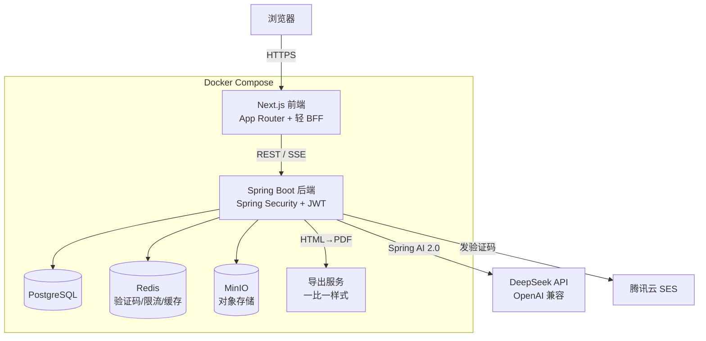

# 架构总览

> 项目级技术地图——给 AI 和接手者快速建立全局认知。
> **living document，随架构演进持续增量更新**，永远停在当前真实状态：已确定的写、未确定的留空待补。
> 单个功能的内部设计在各功能 `设计.md`；这里只放**跨功能的全局架构**。
> 章节固定、按编号保留，不适用就注明「不适用」、不删。

---

## 1. 技术栈

> 版本为 2026-06 联网核实、成套确认兼容；精确 patch 交给 lockfile，本表只钉主/次版本。

| 层 | 选型 | 说明 |
|---|---|---|
| 前端 | Next.js（App Router）+ React + TypeScript | Next 16.2 / React 19.2 / Node 22 LTS；Turbopack 默认构建 |
| 后端 | Spring Boot + Java | Spring Boot 4.1 / Java 21 LTS；Spring Framework 7 |
| 鉴权 | Spring Security + JWT | 无状态鉴权，JWT 存 httpOnly cookie |
| API 文档 | springdoc-openapi（Swagger UI） | 后端接口自动生成 OpenAPI 文档 |
| 数据库 | PostgreSQL | 18.x；结构化数据 + JSONB 存简历模块等半结构内容 |
| 缓存 | Redis | 7.x；邮箱验证码 TTL、接口限流、热点缓存 |
| 对象存储 | MinIO | S3 兼容、可自托管，存简历导出文件 / 头像等 |
| 简历导出 | 独立服务端导出服务（容器） | 渲染与前端**一比一样式**的 PDF，保证所见即所得（候选 Gotenberg，M2 立项时定） |
| 邮件 | 腾讯云 SES | 发送邮箱验证码 |
| AI | DeepSeek，经 Spring AI 2.0 抽象 | 模型 `deepseek-v4-flash`（日常）/ `deepseek-v4-pro`（复杂分析）；OpenAI 兼容；Spring AI 屏蔽厂商、保留可切换能力 |
| 容器化 | Docker + Docker Compose | 前端 / 后端 / 导出服务 / Postgres / Redis / MinIO 统一编排 |
| 部署 | 香港轻量云服务器 | 免备案；后续可能迁移 |

---

## 2. 系统架构



- **前后端分离**：Next.js 负责渲染与轻量 BFF（聚合/转发），Spring Boot 提供 REST API；AI 流式输出走 **SSE**（后端 → 前端 → 浏览器）。
- **鉴权**：登录后签发 JWT，存 httpOnly cookie；后端无状态校验。
- **AI 调用**：统一经 Spring AI 抽象层访问 DeepSeek，厂商可切换。
- 全部组件由 Docker Compose 编排，本地与香港云同构。

---

## 3. 目录结构

> Monorepo，前后端与部署同仓，便于开源贡献者一键拉起。

```
mockoffer/
├── frontend/        Next.js 前端（App Router）
├── backend/         Spring Boot 后端（REST API + AI + 鉴权）
├── deploy/          docker-compose、Nginx、env 模板、导出服务编排
├── docs/            项目文档（架构/设计规范/部署/功能）
├── README.md
└── CHANGELOG.md
```

> 简历导出服务若采用现成镜像（如 Gotenberg），仅在 `deploy/` 编排、无需独立代码目录；若需自建再加 `export-service/`。M2 立项时定。

---

## 4. 数据模型总览

> 全局核心实体与关系；字段级细节在各功能 `设计.md` §3.3。

| 实体 | 职责 | 关键关系 |
|---|---|---|
| `users` | 账号（邮箱 / GitHub 身份、无密码） | 1—1 `user_profiles` |
| `user_profiles` | 个人信息（供模板自动录入） | 属于 `users` |
| `resume_templates` | 简历模板（系统级） | 被 `resumes` 引用 |
| `resumes` | 简历（模块显隐 / 自定义模块 / 排序等存 JSONB） | 属于 `users`，引用 `resume_templates` |
| `jobs` | 目标岗位信息（首版复制粘贴录入） | 属于 `users` |
| `match_analyses` | 人岗匹配结果（打分 / 不足项） | 关联 `resumes` × `jobs` |
| `interviews` | 模拟面试会话 | 关联 `resumes` + `jobs` |
| `interview_turns` | 每轮对话 + 该轮后台打分/评价/建议/下一题推断 | 属于 `interviews` |
| `interview_reports` | 面试报告（总分/分项/优点/可优化点/回顾） | 1—1 `interviews` |
| 计费相关（M7） | 套餐 / 订阅 / AI 用量额度 | 属于 `users`（M7 立项时细化） |

---

## 5. 全局关键决策（ADR）

- **前后端分离（Next.js + Spring Boot）**：用户指定；前端生态做富交互简历编辑器，后端 Java 生态稳健承载业务/AI/鉴权。
- **Spring Boot 4.1（非 3.5）**：3.5 于 2026-06-30 OSS 停止维护，开源长期项目不能新建在 EOL 分支；4.1 为脚手架实测的当前 GA。
- **Spring AI 2.0 抽象 AI**：2.0.0 GA（2026-06-12）已发布，需 Spring Boot 4.0+（我们用 4.1），正好成套；统一封装流式/多轮记忆/结构化输出，保留多厂商可切换（满足「可切换抽象层」诉求）。AI 从 M4 才落地。
- **DeepSeek 为首选模型**：国产、OpenAI 兼容、成本极低（`deepseek-v4-flash` 约 $0.14/$0.28 每百万 token），适合「AI 养活项目」。旧模型名 `deepseek-chat/reasoner` 于 2026-07-24 弃用，统一用 `deepseek-v4-flash/pro`。
- **PostgreSQL + JSONB**：结构化主数据 + 简历模块等半结构内容用 JSONB，省去频繁加表。
- **Redis**：邮箱验证码（TTL）、接口限流、热点缓存。
- **MinIO 自托管对象存储**：S3 兼容、开源友好，避免绑定云厂商，自托管者零成本可跑。
- **导出服务独立、样式一比一**：服务端用与前端相同的 HTML/CSS 渲染 PDF，保证导出所见即所得。
- **JWT 无状态鉴权**：JWT 存 httpOnly cookie，水平扩展友好。
- **Docker Compose 统一编排**：本地与香港云同构，开源贡献者一键拉起。

---

## 6. 环境与配置（dev / prod）

- **环境区分方式**：Spring Boot 用 profile（`dev` / `prod`）；前端用 Next.js 环境变量（`.env` + 部署平台注入）。
- **按环境不同的行为**：本地 dev 用 Compose 起全套依赖；prod 指向香港云上的同套服务。差异只用 profile / 环境变量区分，不加 feature flag 开关。
- **密钥管理**：DeepSeek API Key、SES 凭证、JWT 密钥、GitHub OAuth、MinIO 凭证等一律走环境变量注入，不入库、不进仓库。
- 实际部署步骤见 `docs/部署手册.md`。
